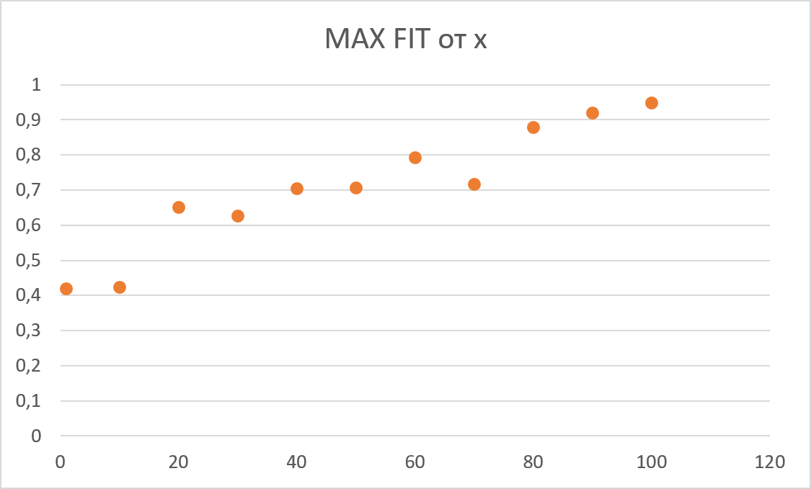

# Генетический алгоритм
**Задача:** реализовать алгоритм, в основе которого лежит *генетическая модель оптимизации*, для нахождения масимума заданной функции.
В задачу входит:
- Программная реализация алгоритма
- Проведение анализа полученных результатов
- Оформление отчета

## Полученные результаты:
### Функция

### Визуализация результатов поиска:
- #### Изменение максимального значения

- #### Изменение среднего значения

### Результат нахождения масимального значениее
- Ожидаемое:  1
- Полученное: 0,947

Полученные результаты говорят о корректности работы алгоритма
